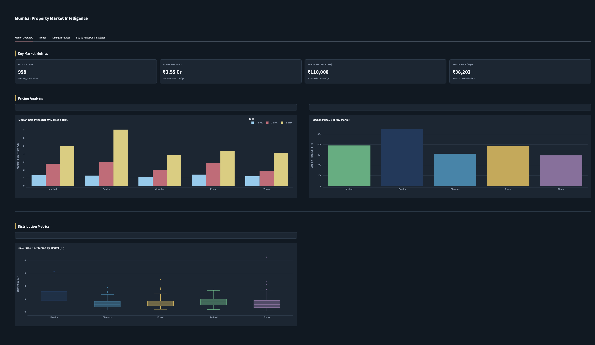
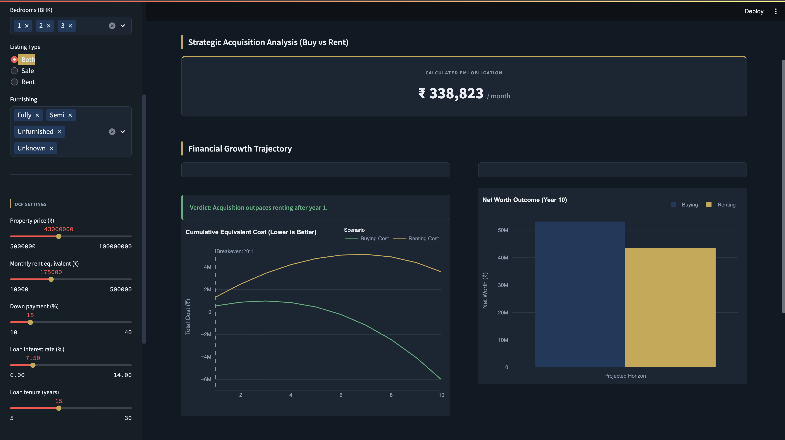
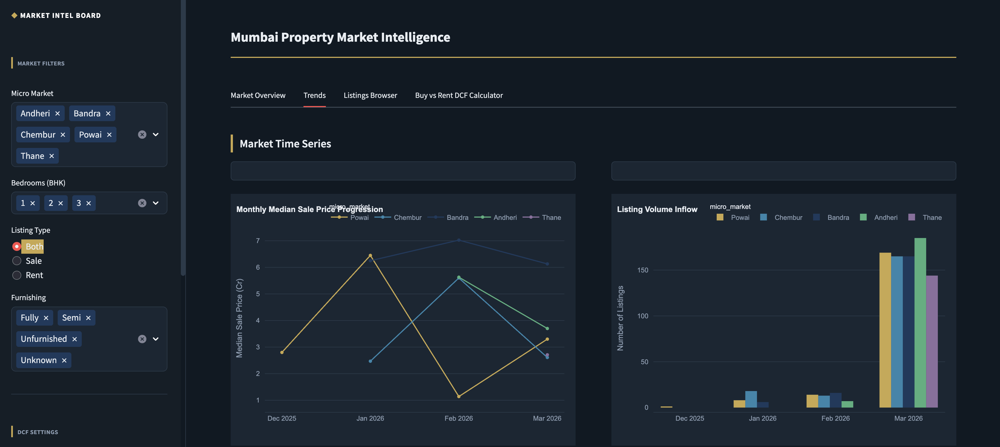

# Mumbai Property Market Intelligence Dashboard

A data-driven Streamlit dashboard for analysing residential property listings across 5 Mumbai micro-markets. Built with real scraped data from MagicBricks, it helps buyers, renters, and investors compare prices, rental yields, and make buy-vs-rent decisions using a DCF calculator.

---

## Live Demo

> [View Dashboard →] [https://mumbai property dcf calculator](https://mumbaipropertydcfcalculator-zivr63dbqmaywnf3mx9lmh.streamlit.app/)

---

## Screenshots







---

## Features

- **Market Overview** — KPI cards showing total listings, median sale price, median rent and median price/sqft, with BHK-wise price comparison charts and price distribution box plots across all micro-markets
- **Trends** — Monthly median sale price and rent progression over time per micro-market, plus listing volume inflow charts
- **Listings Browser** — Filterable, searchable table of all 958 real listings with direct links back to MagicBricks source pages
- **Buy vs Rent DCF Calculator** — Interactive financial model comparing the total cost and net worth of buying vs renting over a custom time horizon, with EMI calculation and breakeven year detection

---

## Project Structure

```
mumbai_property_project/
├── data/
│   └── cleaned_listings.csv      # Cleaned and enriched dataset (958 listings)
├── app.py                        # Main Streamlit application
├── requirements.txt              # Python dependencies
├── .gitignore                    # Git ignore rules
└── README.md                     # This file
```

> `raw_listings.csv` and `clean_data.py` are excluded from the repository via `.gitignore`.

---

## Dataset

| Field | Description |
|---|---|
| `micro_market` | Bandra, Chembur, Powai, Andheri, Thane |
| `sub_locality` | Neighbourhood within the micro-market |
| `bedrooms` | 1 BHK, 2 BHK, or 3 BHK |
| `listing_type` | Sale or Rent |
| `sale_price_inr` | Sale price in ₹ (Sale listings only) |
| `monthly_rent_inr` | Monthly rent in ₹ (Rent listings only) |
| `area_sqft` | Carpet area in sq ft (available for ~463 rows) |
| `price_per_sqft` | Derived: sale_price ÷ area_sqft |
| `annual_rent` | Derived: monthly_rent × 12 |
| `sale_price_cr` | Derived: sale_price ÷ 10,000,000 |

**958 total listings** — 484 Sale + 474 Rent — collected from MagicBricks in March 2026.

---

## Micro-Markets Covered

| Market | Listings | Avg Sale Price | Avg Price/SqFt |
|---|---|---|---|
| Bandra | 200 | ~₹5–7 Cr | ~₹52,000 |
| Chembur | 200 | ~₹2–4 Cr | ~₹30,000 |
| Powai | 200 | ~₹3–5 Cr | ~₹38,000 |
| Andheri | 200 | ~₹2–4 Cr | ~₹38,000 |
| Thane | 158 | ~₹2–4 Cr | ~₹29,000 |

---

## Getting Started

### Prerequisites

- Python 3.9+
- pip

### Installation

```bash
# Clone the repository
git clone https://github.com/your-username/mumbai-property-dashboard.git
cd mumbai-property-dashboard

# Install dependencies
pip install -r requirements.txt
```

### Run the dashboard

```bash
streamlit run app.py
```

The app will open at `http://localhost:8501`

---

## Requirements

```
streamlit
pandas
plotly
numpy
openpyxl
```

Install all at once:

```bash
pip install -r requirements.txt
```

---

## How the DCF Calculator Works

The Buy vs Rent calculator compares two financial paths over a user-defined horizon:

**Buying path:**
- Down payment paid upfront
- Monthly EMI calculated using the standard loan amortisation formula
- Property value appreciates at the chosen annual rate
- Net cost = cumulative payments − current property value

**Renting path:**
- Monthly rent paid, increasing annually at the rent growth rate
- Down payment amount invested and compounded at the investment return rate
- Net cost = cumulative rent paid − investment portfolio value

**Breakeven year** — the year when the net cost of buying first drops below the net cost of renting. If the lines never cross within the horizon, renting remains the better financial option at those assumptions.

---

## Sidebar Filters

| Filter | Options |
|---|---|
| Micro Market | Bandra, Chembur, Powai, Andheri, Thane (multiselect) |
| Bedrooms (BHK) | 1, 2, 3 (multiselect) |
| Listing Type | Both / Sale / Rent |
| Furnishing | Fully / Semi / Unfurnished / Unknown |

DCF calculator inputs — property price, loan rate, tenure, appreciation rate, investment return, and analysis horizon — are in the sidebar below the market filters.

---

## Data Collection

Data was collected using a Selenium browser automation scraper targeting MagicBricks listing pages across the 5 micro-markets. The scraper handles pagination, dismisses cookie popups, applies random delays between requests to avoid blocking, and saves progress to CSV every 10 rows. Deduplication is done by `source_url`.

> **Note:** Web scraping MagicBricks may conflict with their Terms of Service. This project is for educational and personal research purposes only.

---

## Tech Stack

| Tool | Purpose |
|---|---|
| Python | Core language |
| Selenium | Web scraping |
| Pandas | Data cleaning and analysis |
| Streamlit | Dashboard framework |
| Plotly | Interactive charts |
| NumPy | Financial calculations |

---

## Future Improvements

- Add Navi Mumbai as a 6th micro-market
- Automate monthly data refresh via scheduled scraping
- Add rental yield heatmap by sub-locality
- Integrate real mortgage rate data from RBI/bank APIs
- Add export to PDF/Excel from the listings browser
- Top-up `area_sqft` for the ~485 listings currently missing it

---

## License

This project is for educational purposes. Property data sourced from MagicBricks is subject to their terms of service.
